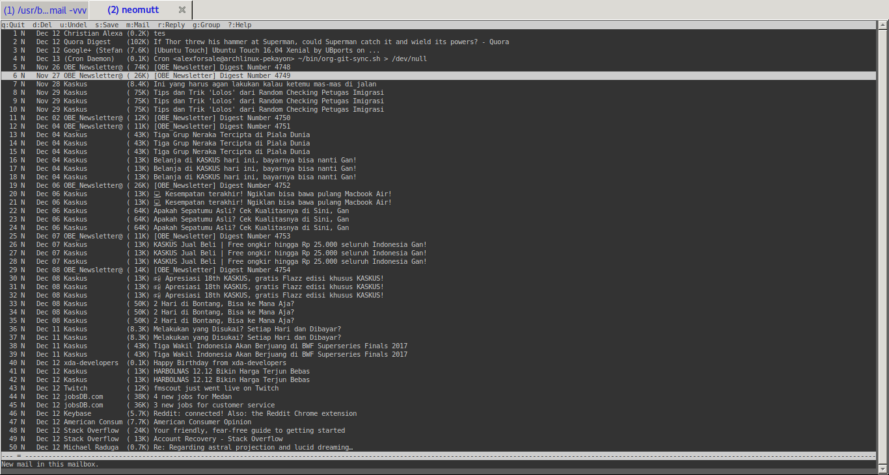

# Apa yang ingin kita raih?
Saya memiliki banyak account email, tetapi untungnya semua email itu bisa di forward ke email utama saya, Gmail. Walau ada beberapa email yang tidak memiliki fitur forwarding tersebut namun setidaknya mereka menyediakan fitur imap/pop3, yang bisa disetup dari dalam Gmail.

Client yang akan kita gunakan adalah NeoMutt, bisa juga Mutt, yang sudah ada lebih dulu. Namun keunggulan dari NeoMutt ini karena developernya mengambil setiap patch - patch Mutt yang kebanyakan sudah diabaikan. Bagi yang tertarik untuk melihat source codenya bisa langsung lihat di repository [github mereka](https://github.com/neomutt/neomutt).

Walaupun sebenarnya Mutt(dan NeoMutt) sudah memiliki fitur imap dan smtp native namun untuk support imap masih belum tersedia fitur offline, dan untuk smtp saya sebelumnya sudah menggunakan [msmtp]({{ site.baseurl }}), jadi tidak perlu mengisi credential yang sama berulang.

## Installing

Sebelumnya kita install terlebih dahulu package yang diperlukan.

``` shell
sudo pacman -S neomutt w3m getmail procmail spamassassin razor --noconfirm --needed
yaourt -S --noconfirm urlview
mkdir -p ~/.getmail
chmod 700 ~/.getmail
touch ~/.getmail/getmailrc
mkdir -p ~/.mail/{cur,new,tmp,spam,mbox,draft}
```

## getmail

Edit file `~/.getmail/getmailrc` seperti ini

```
[retriever]
type = SimpleIMAPSSLRetriever
server = imap.gmail.com
username = USER
password = PASS
[destination]
type = Maildir
path = ~/.mail/

[options]
read_all = False

[options]
verbose = 0

[destination]
type = MDA_external
path = /usr/bin/procmail
```

untuk password, karena akun Gmail saya menggunakan 2-step verification, jadi saya terlebih dahulu melakukan request app-password di [website Google](https://myaccount.google.com/apppasswords), dan mengisi kolom passwor di `~/.getmailrc` dengan app-password tersebut.

## procmail

Lakukan konfigurasi procmail sebelum kita mencoba getmail, edit file `~/.procmailrc`:

```
# Please check if all the paths in PATH are reachable, remove the ones that
# are not.

PATH=$HOME/bin:/usr/bin:/bin:/usr/local/bin:.
MAILDIR=$HOME/.mail	# You'd better make sure it exists
DEFAULT=$MAILDIR/new
LOGFILE=$MAILDIR/from
LOCKFILE=$MAILDIR/.lockmail

# By using the f and w flags and no condition, spamassassin is going add the X-Spam headers to every single mail, and then process other recipes.
# No lockfile is used.
:0fw
| /usr/bin/vendor_perl/spamc

# Messages with a 5 stars or higher spam level are going to be deleted right away
# And since we never touch any inbox, no lockfile is needed.
:0
* ^X-Spam-Level: \*\*\*\*\*
/dev/null

# If a mail with spam-status:yes was not deleted by previous line, it could be a false positive. So its going to be sent to an spam mailbox instead.
# Since we do not want the possibility of one procmail instance messing with another procmail instance, we use a lockfile
:0:
* ^X-Spam-Status: Yes
$MAILDIR/spam
```

Note untuk `$MAILDIR` ini sebaiknya di set melalui `~/.bashrc` atau `~/.profile`.

## NeoMutt

coba jalankan `getmail -vv`, jika tidak ada error maka kita bisa melanjutkan otomatisasi dengan menggunakan `crontab`, misalnya jika kita ingin pull message baru setiap 10 menit:

`crontab -e`

Lalu edit file nya dengan mengisi ini:

`*/10 * * * * /usr/bin/getmail`

Edit konfigurasi neomutt. Dari [guide-nya](https://www.neomutt.org/guide/configuration) ada banyak pilihan untuk lokasi file konfigurasi mutt/neomutt. Untuk simpelnya saya simpan di `~/.mutt'` dengan file konfigurasi utama `~/.mutt/muttrc`, dengan begini lokasi tersebut dapat digunakan bagi pemakai mutt juga.

`~/.mutt/muttrc`:

```
## General options

# editor yang digunakan untuk mengirim email
set editor=`echo \$EDITOR`

# Sangat membantu speed ketika membuka folder didalam neomutt
set header_cache = "~/.cache/mutt"

# nama
set realname='Christian Alexander'

# program yang dipakai untuk mengirim mail, dengan package msmtp-mta, sendmail adalah alias dari msmtp
set sendmail="/usr/bin/msmtp"

# agar dapat edit headers ketika reply atau forward
set edit_headers=yes

# base directory dari folder, setiap + di file ini berarti ekspansi dari folder yang diset disini
set folder=~/.mail

# menentukan lokasi menyimpan mail yang sudah dibaca di spoolfile.
set mbox=+mbox

# set charset
set send_charset="utf-8"

set spoolfile=+/
set record=+sent
set postponed=+draft
set mbox_type=Maildir

# format yang digunakan ketika forward
set forward_format="Fwd: %s"

# menentukan apakah isi dari message yang kita reply dicantumkan dalam reply tersebut
set include

# menentukan file yang harus dicari ketika mutt mencoba menampilkan MIME yang tidak disuport
set mailcap_path=~/.mutt/mailcap

# menentukan jumlah baris yang diperlihatkan ketika menampilkan page sebelum/sesudah didalam pager internal
set pager_context=5

# menentukan jumlah baris dari mini-index yang terlihat ketika didalam pager
set pager_index_lines=10

# internal pager tidak akan pindah ke message berikutnya ketika kita berada diakhir message.
set pager_stop

# ketika reply message alamat reply-to yang digunakan
set reply_to

# menentukan metode sortir message
set sort=threads

# menentukan metode sortir message dalam thread
set sort_aux=reverse-last-date-received

# directory temp
set tmpdir=~/.mutt/temp

# kita harus set mailcap untuk ini
auto_view text/html
```

Untuk file `~/.mutt/mailcap` isinya sebagai berikut:

````
application/octet-stream ; echo %s "can be anything..."                    ; copiousoutput
text/html                ; /usr/bin/w3m -dump %s    ; nametemplate=%s.html ; copiousoutput
application/pdf          ; /usr/bin/okular %s                              ; copiousoutput
image/*                  ; /usr/bin/feh %s                                 ; copiousoutput
audio/*                  ; /usr/bin/vlc %s                                 ; copiousoutput
video/*                  ; /usr/bin/vlc %s                                 ; copiousoutput
````

Sesuaikan dengan aplikasi yang digunakan, w3m bisa diganti dengan elinks, sebagai terminal web browser.

`set sendmail="/usr/bin/msmtp"` mengacu kepada [post saya sebelumnya]({{ site.baseurl }}). Jika tidak diset, akun default yang akan digunakan.



Ini adalah konfigurasi minimal untuk NeoMutt.
