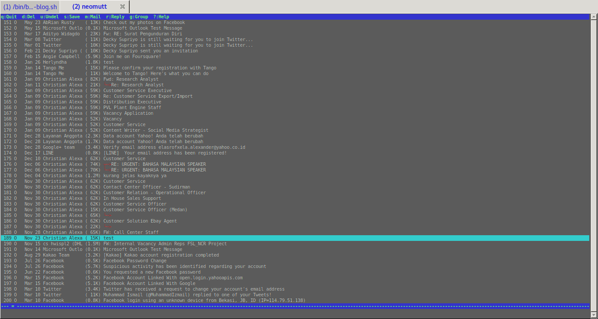

# Background mengikuti theme terminal

Edit file `~/.mutt/muttrc`, tambahkan baris ini dipaling bawah:

```
source ~/.mutt/colors
```

Isi file tersebut (`~/.mutt/colors`) dengan ini:

```
color normal  white default
color attachment brightyellow default
color hdrdefault cyan default
color indicator black cyan
color markers brightred default
color quoted  green default
color signature cyan default
color status  brightgreen blue
color tilde blue default
color tree  red default

color index red default ~P
color index red default ~D
color index magenta default ~T

color header brightgreen default ^From:
color header brightcyan default ^To:
color header brightcyan default ^Reply-To:
color header brightcyan default ^Cc:
color header brightblue default ^Subject:

color body  brightred default [\-\.+_a-zA-Z0-9]+@[\-\.a-zA-Z0-9]+
# identifies email addresses

color body  brightblue default (https?|ftp)://[\-\.,/%~_:?&=\#a-zA-Z0-9]+
# identifies URLs
```



# sidebar

Tambahkan baris ini kedalam `~/.mutt/muttrc`:

```
set sidebar_visible
set sidebar_format = "%B%?F? [%F]?%* %?N?%N/?%S"
set mail_check_stats
```

# Multiple account

Salah satu fitur dari msmtp adalah kemampuannya untuk menggunakan lebih dari satu account dalam satu file Konfigurasi(`'~/.msmtprc`). Kita pun bisa memanfaatkan fitur ini didalam neomutt/mutt.

Di [post]({{ site.baseurl }}) saya sebelumnya sudah dibahas mengenai konfigurasi dari *msmtp*, dan untuk menyegarkan ingatan, ini adalah konfigurasi penuh saya:

```
# Set default values for all following accounts.
defaults

logfile        ~/.msmtp.log
#aliases        /etc/aliases

# Gmail
account        gmail
auth           on
tls            on
tls_trust_file /etc/ssl/certs/ca-certificates.crt
host           smtp.gmail.com
port           587
from           alexarians@gmail.com
user           alexarians@gmail.com
passwordeval   "gpg --quiet --for-your-eyes-only --no-tty --decrypt ~/.msmtp-gmail.gpg"

# Yahoo service
account        yahoo
auth           on
tls            on
tls_trust_file /etc/ssl/certs/ca-certificates.crt
host           smtp.mail.yahoo.com
port           587
from           alexforsale@yahoo.com
user           alexforsale
passwordeval   "gpg --quiet --for-your-eyes-only --no-tty --decrypt ~/.msmtp-yahoo.gpg"

# Hotmail
account        hotmail
tls            on
tls_certcheck  off
host           smtp.live.com
from           christian.alexander@windowslive.com
auth           on
user           christian.alexander@windowslive.com
passwordeval   "gpg --quiet --for-your-eyes-only --no-tty --decrypt ~/.msmtp-hotmail.gpg"

# Set a default account
account default : gmail
```

Terlihat lebih aman karena semua password di encrypt menggunakan [GnuPG](https://gnupg.org/). Jadi saya memiliki tiga akun smtp yang bisa saya pilih. Dan untuk menggunakannya didalam Mutt/NeoMutt tambahkan baris ini di `~/.mutt/muttrc`:

```
send2-hook '~f alexarians@gmail.com' 'set sendmail="/usr/bin/msmtp"'
send2-hook '~f alexforsale@yahoo.com' 'set sendmail="/usr/bin/msmtp -a yahoo"'
send2-hook '~f alexforsale@hotmail.com' 'set sendmail="/usr/bin/msmtp -a hotmail"'
```

Tentunya sesuaikan terlebih dahulu email yang digunakan, lokasi dari binary *msmtp*-nya. Untuk penjelasan dari argumen diatas:

- `send2-hook`: Ketika ada pattern berubah (baik melalu edit atau menu compose), perintah dieksekusi. Sedangkan untuk
- `'-f expression'`: Artinya message yang berasal dari expression tersebut.
- `set sendmail`: Adalah perintah yang harus dieksekusi berdasarkan expression, note untuk alexarians@gmail.com perintah msmtp tidak menggunakan parameter tambahan karena merupakan default di msmtprc.
