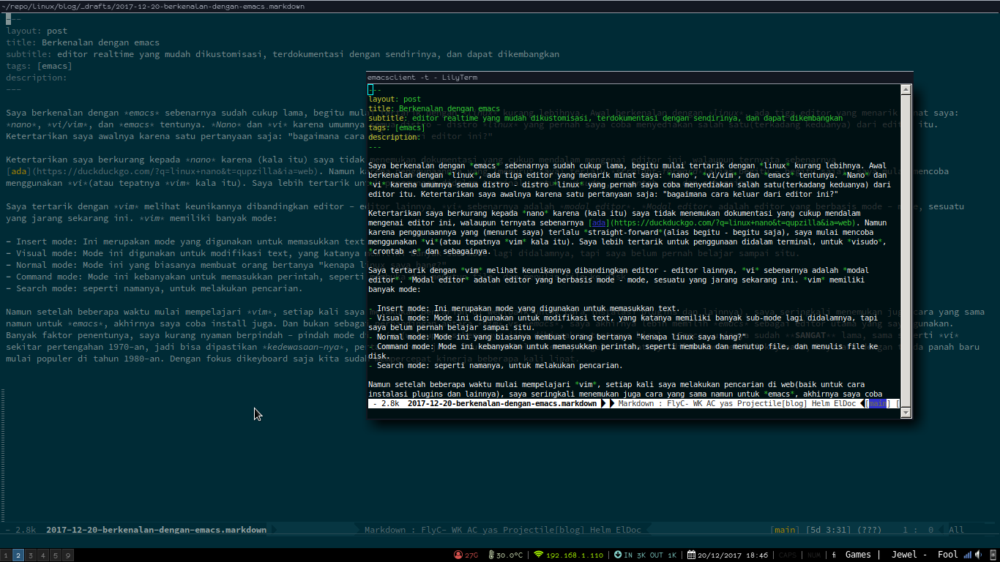
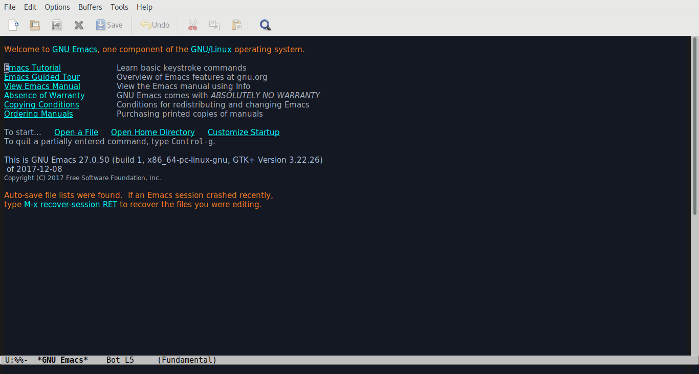

Saya berkenalan dengan *emacs* sebenarnya sudah cukup lama, begitu mulai tertarik dengan *linux* kurang lebihnya. Awal berkenalan dengan *linux*, ada tiga editor yang menarik minat saya: *nano*, *vi/vim*, dan *emacs* tentunya. *Nano* dan *vi* karena umumnya semua distro - distro *linux* yang pernah saya coba menyediakan salah satu(terkadang keduanya) dari editor itu. Ketertarikan saya awalnya karena satu pertanyaan saja: "bagaimana cara keluar dari editor ini?"

Ketertarikan saya berkurang kepada *nano* karena (kala itu) saya tidak menemukan dokumentasi yang cukup mendalam mengenai editor ini, walaupun ternyata sebenarnya [ada](https://duckduckgo.com/?q=linux+nano&t=qupzilla&ia=web). Namun karena penggunaannya yang (menurut saya) terlalu *straight-forward*(alias begitu - begitu saja), saya mulai mencoba menggunakan *vi*(atau tepatnya *vim* kala itu). Saya lebih tertarik untuk penggunaan didalam terminal, untuk *visudo*, *crontab -e* dan sebagainya.

Saya tertarik dengan *vim* melihat keunikannya dibandingkan editor - editor lainnya, *vi* sebenarnya adalah *modal editor*. *Modal editor* adalah editor yang berbasis mode - mode, sesuatu yang jarang sekarang ini. *vim* memiliki banyak mode:

- Insert mode: Ini merupakan mode yang digunakan untuk memasukkan text.
- Visual mode: Mode ini digunakan untuk modifikasi text, yang katanya memiliki banyak sub-mode lagi didalamnya, tapi saya belum pernah belajar sampai situ.
- Normal mode: Mode ini yang biasanya membuat orang bertanya "kenapa linux saya hang?"
- Command mode: Mode ini kebanyakan untuk memasukkan perintah, seperti membuka dan menutup file, dan menulis file ke disk.
- Search mode: seperti namanya, untuk melakukan pencarian.

Namun setelah beberapa waktu mulai mempelajari *vim*, setiap kali saya melakukan pencarian di web(baik untuk cara instalasi plugins dan lainnya), saya seringkali menemukan juga cara yang sama namun untuk *emacs*, akhirnya saya coba install juga. Dan bukan sebagai perbandingan antara *vim* vs *emacs*, saya akhirnya lebih memilih *emacs* sebagai editor utama yang saya gunakan. Banyak faktor penentunya, saya kurang nyaman berpindah - pindah mode di *vim*(walaupun sebenarnya jika dibiasakan tentunya bisa). *Emacs* usianya sudah **SANGAT** lama, sama seperti *vi* sekitar pertengahan 1970-an, jadi bisa dipastikan *kedewasaan-nya*, pertama karena jaman itu mouse belum tenar, segala sesuatunya dilakukan melalui keyboard, keyboard dengan tanda panah baru mulai populer di tahun 1980-an. Dengan fokus dikeyboard saja kita sudah mempercepat kinerja beberapa kali lipat.

# Fitur Emacs

Diluar dari fitur standarnya yang sebagai editor file text, *emacs* memiliki fitur - fitur spesial lainnya yang dapat membantu kita menulis dalam banyak bahasa manusia maupun bahasa programming atau bahasa markup(markup languages). Dan juga dapat digunakan sebagai alat untuk melakukan *compiling*, *running* ataupun *testing* program, dapat juga dipakai sebagai alat untuk membandingkan dua file dan menyorot perbedaannya. Emacs bahkan dapat digunakan sebagai alat yang sudah diluar fungsi dari editor text, seperti sebagai *file manager*, sebagai *email client* untuk membaca mail dan RSS Feed, bahkan bisa digunakan untuk bermain tetris!

Dan semua fitur diatas tadi sudah ada didalam *emacs* yang belum dikustomisasi! Kita masih belum membicarakan mengenai package - package yang yang bisa kita ambil dari repository utama *emacs*, dan repository lain.

## Kemampuan integrasi dengan tools lain

Ada beberapa tools yang bisa dipanggil dari dalam *emacs* langsung,

- Shell: Terminal emulator didalam *emacs*.
- Compile: Dengan `make` output dari kompilasi akan ditampilkan langsung, baris error dari output yang berisi nama file dan barisnya bisa kita klik langsung untuk masuk ke file yang bersangkutan.
- grep: Seperti compile, jika kita klik nama file yang cocok akan dibawa ke baris tersebut.
- man: menampilkan man page.
- calculator dan
- calendar

## Version Control

*Emacs* dapat membantu kita dalam memanipulasi dan meng-edit file - file yang disimpan dalam *version control*. *Emacs* mendukung CVS, Subversion, bzr, git, hg dan lainnya. *Tampilan* yang didapat menggunakan *interface* yang sama, *VC*, terlepas dari *version control* yang digunakan.

## Edit file jarak jauh

*Emacs* melakukan editing file *remote* secara transparan(seakan - akan file lokal) menggunakan fitur dengan nama *Tramp*. *Emacs* dapat meng-edit file melalui SSH, FTP ataupun metode lainnya. Dengan *emacs* kita dapat edit file dari komputer yang berbeda menggunakan satu sesi *emacs* walaupun *emacs* tidak terpasang di *remote*.

Kita juga bisa edit file lokal menggunakan *permission* user lain. Misalnya seperti edit file dengan *privelege* sudo.

## Emacs Server

Orang terbiasa hanya menggunakan satu sesi *emacs* dan edit semua file disitu. Melakukan ini memiliki beberapa kelebihan:

- Copy/paste yang sama untuk semua file.
- *Emacs* menyimpan semua *Argument history*, seperti perintah - perintah apa saja yang digunakan, file - file apa saja yang dibuka, apa saja yang di *search*.
- Jika kita menggunakan banyak kustomisasi, biasanya memulai *instance* baru memakan waktu.

Kita bisa menggunakan *emacsclient*, yang membuka *frame* baru yang tersambung ke *instance* yang sudah ada. Berguna untuk dipakai sebagai editor untuk git, editing terminal seperti *visudo* dan *crontab* misalnya.

## Mode untuk pengguna vi/vim

*Emacs* menyediakan *viper-mode* agar perilaku *emacs* menyerupai *vi/vim*, tergantung seberapa mirip *vi/vim* yang kita inginkan.

# Perlukah kita belajar emacs?

Ini merupakan pertanyaan pentingnya, sepadankah hasilnya jika kita memulai belajar editor baru dari awal? *Emacs* bisa saja digunakan seperti layaknya editor biasa, namun fitur "ganas"nya bukan hanya itu saja, jika kita hanya menggunakan editor untuk sekedar edit file, lalu geser mouse ke pojok kiri atas untuk klik "file" -> "save" saja sebaiknya tetap gunakan editor yang sekarang dipakai.

Tetapi jika kita mau meluangkan waktu sekitas sejam sehari, untuk mempelajari editor baru tersebut, dan mengetahui benar manfaat apa yang bisa didapat dari mempelajari editor tersebut, coba jalankan tutorial yang ada didalam *emacs* (ketik CTRL-c lalu t).

## Jargon Emacs

Perlu diingat bahwa *emacs* sudah ada sebelum era komputer yang mulai global, jadi banyak dari istilah - istilah dalam *emacs* tidak mengikuti istilah umum.

| Istilah umum          | Istilah Emacs |
|:---------------------:|---------------|
| selection             | region        |
| cut                   | kill          |
| paste                 | yank          |
| window                | frame         |
| pane                  | window        |
| workspace or document | buffer        |
| shortcut              | key sequence  |
| wrap                  | fill          |
| syntax highlighting   | font-lock     |
    
Dalam istilah *emacs*:
- Frame adalah window.
- Window adalah sub-frame.
- Mode line adalah text di border bawah dari window.
- Buffer berisi object *emacs* seperti text. Sebuah buffer bisa saja tidak terlihat dibeberapa window.
- minibuffer adalah buffer khusus untuk menjalankan perintah; terlihat sebagai frame terpisah atau berada dipaling bawah setiap frame.
- Cursor memperlihatkan dimana kita memasukkan text.
- Pointer yang memperlihatkan posisi mouse.
- Posisi dari kursor disebut point.
- Tombol pada mouse biasa disebut `mouse-1`, `mouse-2`, dan `mouse-3`.
- Key binding adalah mapping antara perintah *emacs* dengan key-sequence.
- Keymap adalah sekumpulan key binding.

## Keybinding yang sering digunakan

Dalam istilah *emacs*, CTRL-c ditulis `C-c`, ALT-c `M-c` dan WIN-c `s-c`

| Keybinding       | fungsi                                         |
|:----------------:|------------------------------------------------|
| `C-c C-h`        | help                                           |
| `C-g`            | quit(seperti ESC)                              |
| `C-x b`          | pindah buffer                                  |
| `C-x right`      | pindah ke buffer kanan                         |
| `C-x left`       | pindah ke buffer kiri                          |
| `C-x k`          | hapus buffer                                   |
|:----------------:|------------------------------------------------|
| `C-x 0`          | tutup window aktif                             |
| `C-x 1`          | tutup semua window kecuali yang aktif          |
| `C-x 2`          | bagi window aktif menjadi 2 window horizontal  |
| `C-x 3`          | bagi window aktif menjadi 2 window vertikal    |
| `C-x o`          | pindah window aktif ke window berikutnya       |
|:----------------:|------------------------------------------------|
| `C-x C-f`        | buka file baru                                 |
| `C-x C-s`        | save file                                      |
| `C-x C-w`        | save file dengan nama baru                     |
| `C-space`        | aktifkan mark region                           |
| `C-w`            | kill region                                    |
| `C-k`            | kill region antara point sampai ke akhir baris |
| `M-w`            | kill region tanpa hapus                        |
| `C-y`            | yank region dari kill ring                     |
| `M-y`            | pindah ke item sebelumnya di kill ring         |
| `M-Y`            | pindah ke item berikutnya di kill ring         |
|:----------------:|------------------------------------------------|
| `C-_` atau `C-/` | undo                                           |
|:----------------:|------------------------------------------------|
| `C-f`            | maju satu karakter                             |
| `C-b`            | mundur satu karakter                           |
| `C-n`            | baris berikutnya                               |
| `C-p`            | baris sebelumnya                               |
|:----------------:|------------------------------------------------|
| `C-a`            | awal baris                                     |
| `C-e`            | akhir baris                                    |
| `M-a`            | kalimat sebelum                                |
| `M-e`            | kalimat sesudah                                |
| `M-v`            | screen sebelum (page up)                       |
| `C-v`            | baris berikut (page down)                      |
| `M-<`            | awal buffer                                    |
| `M->`            | akhir buffer                                   |

Beberapa dari key diatas untuk navigasi berdasarkan dari posisi kita dibuffer, jadi bisa digunakan berulang (`C-p` `C-p` `C-p` berarti 3 baris sebelum). Dan bisa juga menggunakan tambahan *prefix* seperti `C-u` diikuti angka dan perintah navigasi akan mengulang perintah navigasi tersebut sebanyak angka yang dimasukkan. Jika kita menggunakan `C-u` tanpa menambahkan angka, defaultnya adalah 4.

| `C-u 3 C-p`       | mundur 3 baris   |
| `C-u 10 C-f`      | maju 10 karakter |
| `M-1 M-0 C-f`     | maju 10 karakter |
| `C-u C-n`         | Maju 4 baris     |
| `C-u C-u C-n`     | maju 16 baris    |
| `C-u C-u C-u C-n` | maju 64 barisnya |
    
Lompat langsung ke satu baris tertentu:

| `M-g g` | lompat ke baris |

Perintah *search* juga bisa dianggap sebagai bentuk dari navigasi buffer, *incremental search* mempermudah pencarian text berdasarkan *keyword*.

| `C-s` | *incremental search* kedepan    |
| `C-r` | *incremental search* kebelakang |

Mengetik `C-s` diikuti dengan text akan memulai *incremental search*. *Emacs* akan lompat menuju ke text yang ditulis tersebut, selagi kita mengetikkannya. Semua text yang sama akan di*highlight*. Didalam *incremental search* mengetik `C-s` akan lanjut lompat ke text sama berikutnya.

Jika kita menemukan lokasi text yang diinginkan, ketik `RET` (ENTER) akan mengakhiri pencarian di tempat tersebut, atau ketik `C-g` (cancel) untuk kembali ke awal dimana pencarian dimulai. Jika kita mengakhirinya dilokasi salah satu *search*, kita dapat kembali ke lokasi awal dengan ketik `C-x C-x` karena *incremental search* otomatis menyimpan lokasi awal sebagai *mark*.

Perintah berikut mengatur cara - cara pencarian:

| `C-s C-s`   | *search* item yang paling terakhir dicari                  |
| `C-s M-p`   | item sebelumnya di *search history*                        |
| `C-s M-n`   | item berikutnya di *search history*                        |
| `C-h k C-s` | guide untuk command - command lain di *incremental search* |

Untuk *incremental search* kebelakang sama seperti diatas juga.

### Mark

*Emacs* mengingat sesuatu yang dinamakan *mark*, yakni lokasi kursor sebelumnya. Kita dapat menandai *mark* ke lokasi tertentu didalam buffer agar kita dapat mudah kembali kesitu. `C-x C-x` akan mengembalikan kita ke posisi tersebut. Sebenarnya, perintah itu juga memindahkan *mark* ke point sebelumnya; jadi, `C-x C-x` berikutnya akan mengembalikan point ke lokasi aslinya.

| `C-space` | set *mark* di lokasi saat ini     |
| `C-x C-x` | berpindah antara *mark* dan point |

Kita bisa menentukan *mark* secara eksplisit, tapi command - command tertentu otomatis menentukan lokasi *mark*:

| **Ketika kita...**                                        | **mark diset ke**              |
| `C-space`                                                 | lokasi saat ini                |
| lompat ke salah satu ujung dari buffer (`M-<` atau `M->`) | lokasi sebelumnya              |
| mengakhiri *incremental search*                           | lokasi dimulainya *search*     |
| *yank* text                                               | awal *region* yang di *yank*   |
| memasukkan buffer atau file                               | awal dari text yang dimasukkan |

*Emacs* juga menyimpan lokasi - lokasi *mark* sebelumnya. Kita dapat melihat semuanya melalui *mark ring*, yang menyimpan 16 *mark* terakhir yang kita set di buffer saat ini.

| `C-u C-space` | rotasi *mark ring* |

### Region

*Mark juga memiliki fungsi lain: *mark* dan point menentukan *region*. Banyak perintah yang hanya beroperasi ke text yang berada didalam region(diantara *mark* dan point). Kita set region dengan menentukan *mark* lalu memindahkan point ketempat lain, atau dengan klik lalu drag menggunakan mouse. *Emacs* menyediakan beberapa perintah yang akan menentukan region dengan menggerakan *mark* dan point:

| `C-x h` | membuat region berisi seluruh buffer |
| `M-h`   | membuat region dari paragraph        |

*Narrowing* membatasi view (dan editing) dari buffer ke region tertentu. Cukup berguna jika kita hanya sedang beroperasi di bagian tertentu saja dari buffer yang besar(seperti hanya di salah satu chapter dari buku). Maka perintah seperti *incremental search*, `beginning-of-buffer` atau `end-of-buffer` tidak akan membawa kita keluar dari region yang ditentukan, dan perintah seperti search atau replace tidak mempengaruhi seluruh isi file.

| `C-x n n` | *narrow* buffer ke region saat ini |
| `C-x n w` | mengembalikan buffer               |

### Killing ("cutting") text

Sama seperti pergerakan text, *emacs* juga menyediakan command untuk menghapus text.

`C-k` akan menghapus sisa baris setelah point(atau menghapus baris baru setelah point jika point berada diujung baris). Argumen prefix untuk `C-k` dapat dipakai untuk menghapus beberapa baris:

| `C-k`     | kill baris    |
| `C-u C-k` | kill 10 baris |

Perintah berikut beroperasi pada region, dan yang paling mendekati definisi "cut" dan "copy" didalam *emacs*:

| `C-w` | Kill region ("cut")                               |
| `M-w` | save region ke kill ring tanpa menghapus ("copy") |

Perintah dibawah ini cukup berguna:

| `M-d` | kill kata berikut            |
| `M-k` | kill sampai ke akhir kalimat |

Semua perintah diatas membuat text di "kill", yang berarti *emacs* mengambil text tersebut dan menyimpannya untuk dikembalikan ("yanking"). Kebanyakan perintah yang menghapus text dalam jumlah besar melakukan kill dibandingkan benar - benar menghapus, jadi kita dapat menggunakan perintah - perintah ini untuk menghapus text atau cut.

### Yanking ("pasting") text

Setelah text di kill, text tersebut akan disimpan dilokasi yang dinamakan "kill ring" yang kurang lebih sama dengan istilah "clipboard": kita bisa yank sebuah item dari kill ring dengan `C-y`. Namun tidak seperti clipboard, kill ring mampu menyimpan banyak item yang berbeda. Jika item yang kita yank bukan yang kita inginkan ketika mengetik `C-y` ketik `M-y`(berulang, jika perlu) untuk berpindah ke item - item sebelumnya.

| `C-y` | yank item terakhir di kill                      |
| `M-y` | mengganti text yank dengan item kill sebelumnya |

### Undo

Undo dalam *emacs* beroperasi dengan cara yang berbeda dibandingkan dengan editor lain. Setelah sequence undo berturut - turut, *emacs* membuat semua tindakan sebelumnya dapat di undo, termasuk undo itu sendiri.

Undo dapat dipanggil dengan tiga key yang berbeda:

| `C-/`   | Undo |
| `C-_`   | Undo |
| `C-x u` | Undo |

### Search dan replace

| `M-%` | *query replace* |

Perintah *query replace* akan meminta kita untuk memasukkan *string* untuk search dan untuk replace. Lalu, setiap kecocokan dibuffer, kita dapat memilih apakah ingin replace atau tidak. Ini beberapa opsi yang bisa kita pilih:

- ketik `y` untuk replace text yang cocok.
- ketik `n` untuk melewati text dan mencari kecocokan berikutnya.
- ketik `q` untuk keluar dan tidak lagi melakukan replace.
- ketik `.` untuk replace text yang cocok saat ini lalu keluar.
- ketik `!` untuk replace semua kecocokan berikutnya tanpa perlu bertanya lagi.

### Regular expression search

| `C-M-s` | *regular expression incremental search* |

Regular expression adalah cara pencarian beberapa string dalam waktu bersamaan dengan menggunakan bahasa khusus untuk mendeskripsikan bentuk dari apa yang kita cari. Mengenai regular expression(atau regex) bukan merupakan spesifik milik *emacs*, untuk syntax - syntax-nya mungkin perlu satu post khusus. Namun jika kita belum paham mengenai regular expression, atau kita ingin bantuan dalam pembuatan regex yang cukup rumit, kita bisa pakai perintah regexp builder(M-x re-builder). Perintah ini akan menampilkan pop-up window terpisah dimana kita bisa mencoba regexp yang ingin kita test, dan setiap kecocokan yang muncul dari regexp tersebut akan dihighlight.

Tanpa harus melompati tiap kecocokan satu - persatu, kita juga dapat memilih untuk menampilkan semua kecocokan sekaligus. `M-x occur` akan meminta regex dari kita, lalu menampikan semua kecocokan dalam buffer terpisah dalam bentuk list dari semua baris di buffer tersebut yang cocok dengan regex(juga dengan nomor barisnya). Klik salah satu dari baris tersebut akan membawa point ke baris didalam buffer.
